# Report on lab1

## Завдання на лабораторну роботу.

### 1. Зареєструватись в системі під обліковим записом, що збігається з логіном студентської пошти (формат n.surname).

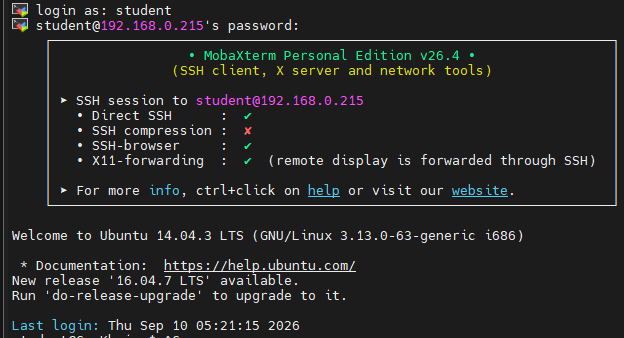

### 2. Використовуючи команду passwd, змінити пароль. Вивчити основні параметри команди. Який системний файл вона змінює?

Команда passwd змінює файл /etc/shadow (де зберігаються хеші паролів користувачів).

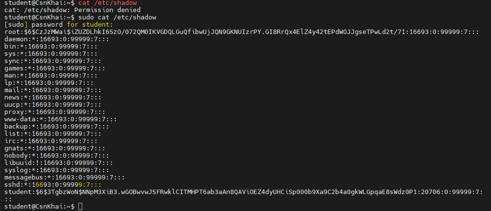

Також вона читає та використовує файл /etc/passwd (де зберігається загальна інформація про облікові записи), а на деяких системах може оновлювати файл /etc/gshadow при зміні паролів груп.

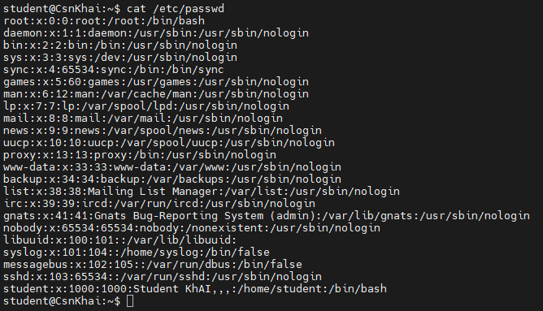

### 3. Визначити користувачів, зареєстрованих у системі, і які команди вони виконують. Яку додаткову інформацію можна отримати при виконанні команди?

Команда w показує, хто зайшов у систему, звідки, що він робить та наскільки завантажений сервер.

```
student@CsnKhai:~$ w
 05:39:50 up 18 min,  2 users,  load average: 0.05, 0.04, 0.05
USER     TTY      FROM             LOGIN@   IDLE   JCPU   PCPU WHAT
student  tty1                      05:21   18:09   0.04s  0.02s -bash
student  pts/0    192.168.0.104    05:22    1.00s  0.02s  0.00s w
student@CsnKhai:~$ 
```

### 4. Змінити особисту інформацію.
#### За допомогою команди finger була виведена інформація на даний момент
```
student@CsnKhai:~$ finger student
Login: student                          Name: Student KhAI
Directory: /home/student                Shell: /bin/bash
On since Thu Sep 10 05:21 (UTC) on tty1    28 minutes 47 seconds idle
     (messages off)
On since Thu Sep 10 05:22 (UTC) on pts/0 from 192.168.0.104
   6 seconds idle
No mail.
No Plan.
```

#### Потім за допомогою команди chfn student була додана інформація.

```
student@CsnKhai:~$ chfn student
Password:
Changing the user information for student
Enter the new value, or press ENTER for the default
        Full Name: Student KhAI
        Room Number []: 1
        Work Phone []: +380
        Home Phone []: +380

student@CsnKhai:~$ finger student
Login: student                          Name: Student KhAI
Directory: /home/student                Shell: /bin/bash
Office: 1, +380                         Home Phone: +380
On since Thu Sep 10 05:21 (UTC) on tty1    29 minutes 46 seconds idle
     (messages off)
On since Thu Sep 10 05:22 (UTC) on pts/0 from 192.168.0.104
   1 second idle
No mail.
No Plan.
```

### 5. Освоїти довідкову систему Linux, а також команди man та info. Отримати довідку за розглянутими раніше командами, визначити та описати два ключі для даних команд. Навести приклади

Згідно з man passwd, команда використовується для зміни паролів користувачів.

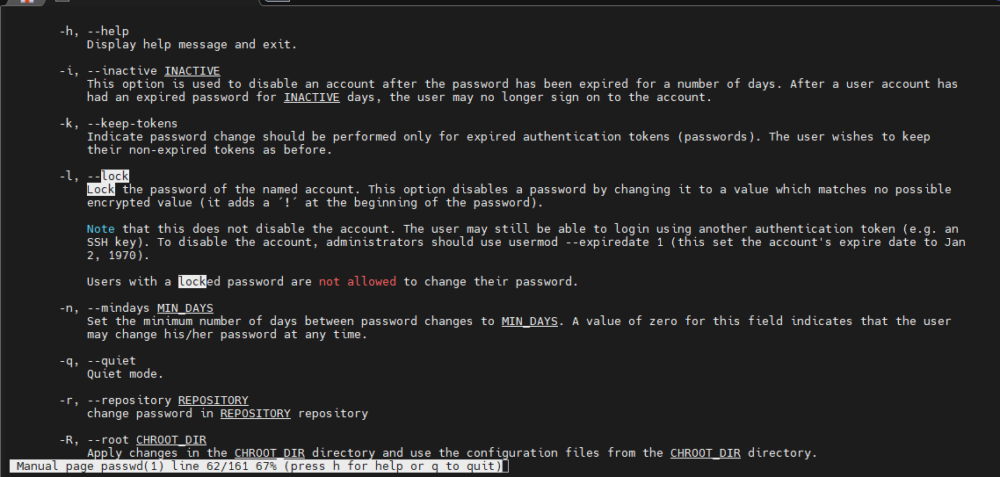

Згідно з man finger, команда виводить особисті дані користувача, вміст файлів .plan, .project тощо.

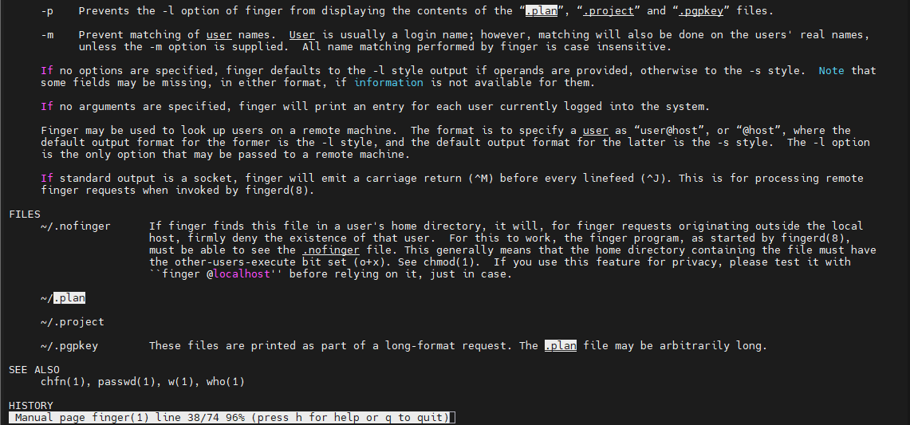

### 6. Вивчити команди more та less за допомогою довідкової системи. За допомогою команд переглянути вміст файлів .bash*.

more призначений для послідовного посторінкового перегляду тексту тільки в один бік (вниз). Команда автоматично завершує роботу й повертає в термінал, як тільки досягає кінця файлу.

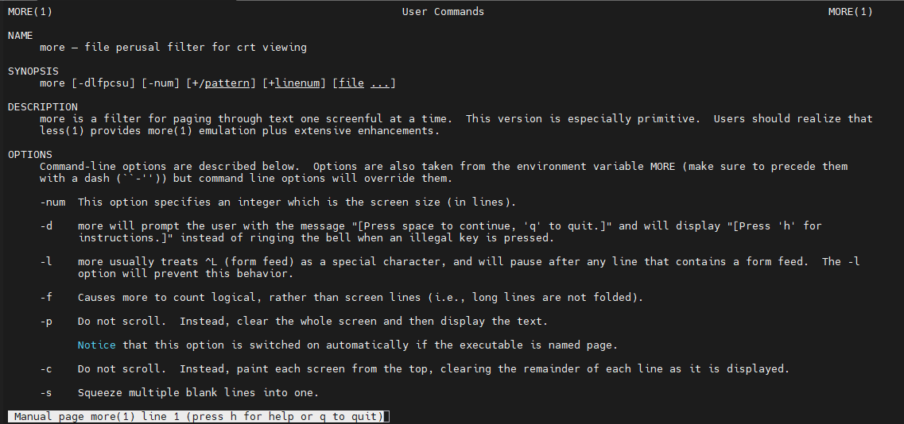

less розроблений як розширена альтернатива more і дозволяє гортати файл в обидва боки (вгору і вниз), виконувати пошук за шаблоном, а також не завантажує увесь файл у пам’ять одразу (що дозволяє миттєво відкривати гігабайтні логи).

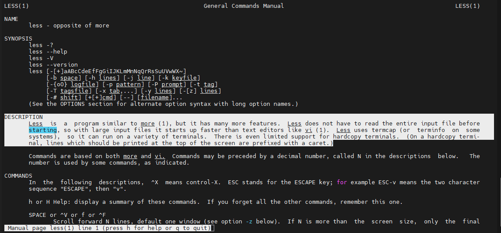

.bash_history — текстовий файл, у який Bash автоматично зберігає список усіх раніше введених у терміналі команд для використання їх через стрілки «Вгору» / «Вниз».

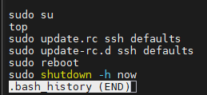

.bash_logout виконується автоматично в момент виходу користувача з сесії (наприклад, коли ви вводите команду exit або закриваєте SSH-з'єднання).
Типовий вміст: Очищення термінала, скидання змінних середовища або видалення тимчасових файлів після завершення роботи.

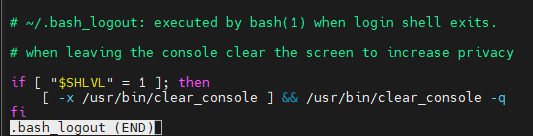

.bashrc — файл конфігурації для кожного нового термінала. Включaє псевдоніми команд (alias), налаштування кольорів термінала, змінну запрошення PS1 та локальні функції.

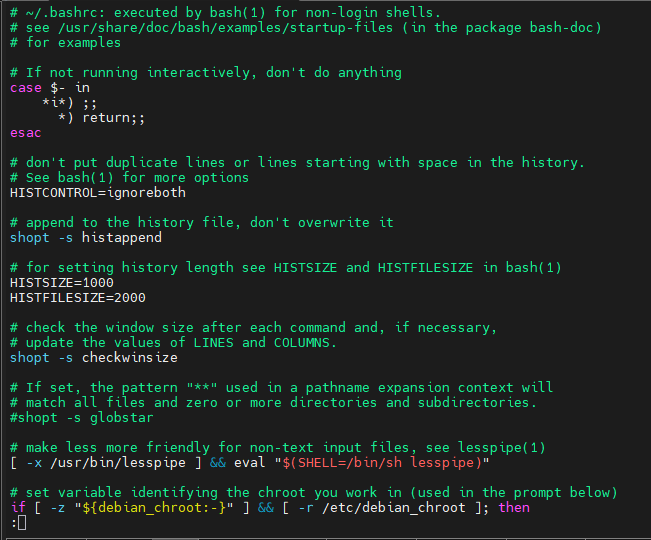

### 7. Описати в планах те, що ви працюєте над лабораторною роботою №1.

#### За допомогою команди nano .plan булв додано план на лабораторну роботу. 

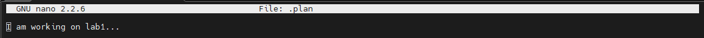

```
student@CsnKhai:~$ nano .plan
student@CsnKhai:~$ finger student
Login: student                          Name: Student KhAI
Directory: /home/student                Shell: /bin/bash
Office: 1, +380                         Home Phone: +380
On since Thu Sep 10 05:21 (UTC) on tty1    32 minutes 23 seconds idle
     (messages off)
On since Thu Sep 10 05:22 (UTC) on pts/0 from 192.168.0.104
   4 seconds idle
No mail.
Plan:
I am working on lab1...
```

### 8. Вивести вміст домашнього каталогу за допомогою команди ls, визначити його файли та каталоги. Підказка: за допомогою довідкової системи ознайомтеся з командою ls.

Команда ls -al виводить повний список усіх файлів і каталогів у поточній директорії у вигляді детальної таблиці.

```
student@CsnKhai:~$ ls -al
total 40
drwxr-xr-x 3 student student 4096 Sep 10 05:53 .
drwxr-xr-x 3 root    root    4096 Sep 15  2015 ..
-rw------- 1 student student  103 Sep 15  2015 .bash_history
-rw-r--r-- 1 student student  220 Sep 15  2015 .bash_logout
-rw-r--r-- 1 student student 3637 Sep 15  2015 .bashrc
drwx------ 2 student student 4096 Sep 15  2015 .cache
-rw------- 1 student student   69 Sep 10 06:20 .lesshst
-rw-rw-r-- 1 student student   24 Sep 10 05:53 .plan
-rw-r--r-- 1 student student  675 Sep 15  2015 .profile
-rw------- 1 student student   53 Sep 10 05:22 .Xauthority
```
